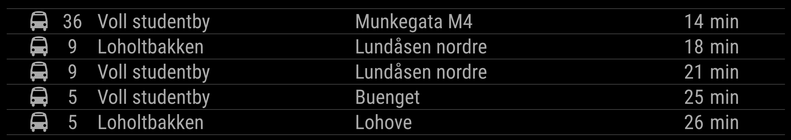
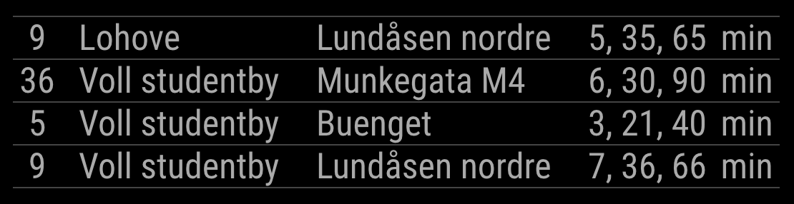

# NesteBussAtB

Modul til [MagicMirror](https://github.com/MichMich/MagicMirror/) som viser hvor mange minutter det er til neste buss til hver destinasjon fra utvalgte holdeplasser går. Plukk ut aktuelle holdeplasser i nærheten. Finn holdeplassenes holdeplassnummer på AtB sin [holdeplassoversikt](https://www.atb.no/holdeplassoversikt/). Legg disse inn i `config.js` som beskrevet nedenfor (stopIds).

Kan også vise en mer kompakt visning med flere avganger av samme buss på samme linje:

## Installasjon

Gå til din `MagicMirror/modules` mappe og skriv

    git clone https://github.com/ottopaulsen/MMM-NesteBussAtB.git
    cd MMM-NesteBussAtB
    npm install

## Konfigurasjon

Dette er default-konfigurasjon med forklaring (skal inn i MagicMirror sin `config.js`:

        {
            module: 'MMM-NesteBussAtB',
            position: 'upper_third',
            config: {
                showIcon: true, // Bus icon in front of row
                showNumber: true, // Bus number
                showFrom: true, // Bus stop name
                showTo: true, // Bus destination
                showMin: true, // "min" text after minutes
                size: "medium", // Text size, for example small, medium or large
                stopIds: [16011496, 16010496], // See https://www.atb.no/holdeplassoversikt/
                maxCount: 2, // Max number of next buses per route
                maxMinutes: 45, // Do not show buses more then this minutes into the future
                stacked: true, // Show multiple buses on same row, if same route and destination
                showMonitored: false, // Write ca in front of minutes if bus isn't monitored (if not stacked)
                showTimeLimit: 45 // If not stacked, show time of departure instead of minutes, if more than this limit until departure.
            }
        },
