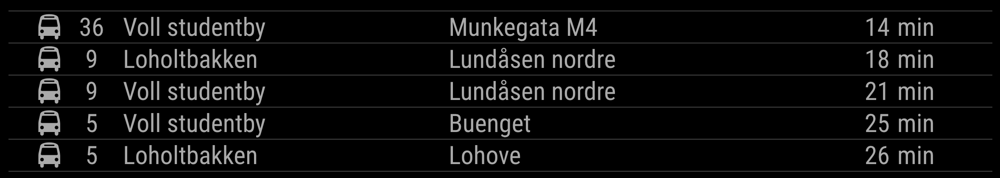
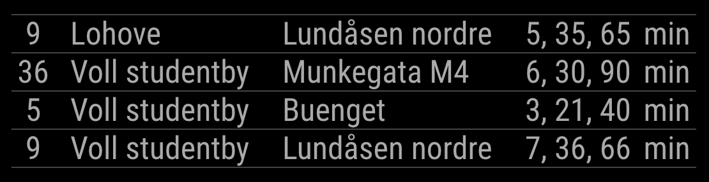

# NesteBussAtB

Modul til [MagicMirror](https://github.com/MagicMirrorOrg/MagicMirror/) som viser hvor mange minutter det er til neste buss til hver destinasjon fra utvalgte holdeplasser. Bruker [Enturs Journey Planner API](https://developer.entur.org/pages-journeyplanner-journeyplanner) (GraphQL).

Kan også vise en mer kompakt visning med flere avganger av samme buss på samme linje:

## Installasjon

Gå til din `MagicMirror/modules` mappe og skriv

    git clone https://github.com/ottopaulsen/MMM-NesteBussAtB.git
    cd MMM-NesteBussAtB
    npm install

## Finn holdeplass-ID

Modulen bruker NSR holdeplass-IDer på formen `NSR:StopPlace:XXXXX`.

Finn riktig id i Enturs kart: https://entur.no/kart

Søk og velg holdeplassen du er interessert i. Du finner da id-en i URL-en. Eksempel: `https://entur.no/kart/stoppested?id=NSR:StopPlace:43210`

Id-en du er ute etter er da `43210`.

## Konfigurasjon

Dette er default-konfigurasjon med forklaring (skal inn i MagicMirror sin `config.js`):

        {
            module: 'MMM-NesteBussAtB',
            position: 'upper_third',
            config: {
                showIcon: true,          // Bus icon in front of row
                showNumber: true,        // Bus number
                showFrom: true,          // Bus stop name
                showTo: true,            // Bus destination
                showMin: true,           // "min" text after minutes
                size: "medium",          // Text size, e.g. small, medium or large
                stopIds: [41613, 41617], // NSR stop IDs — see above for how to find them
                maxCount: 2,             // Max number of next buses per route
                maxMinutes: 45,          // Do not show buses more than this many minutes into the future
                stacked: true,           // Show multiple buses on same row, if same route and destination
                showMonitored: false,    // Write ca in front of minutes if bus isn't real-time (if not stacked)
                showTimeLimit: 45        // If not stacked: show time of departure instead of minutes if more than this limit
            }
        },

## CSS

Du kan overstyre CSS for alt som vises. Tilgjengelige CSS-klasser:

| Klasse | Beskrivelse |
|--------|-------------|
| `.atb-number` | Busstallnummer |
| `.atb-from` | Holdeplassnavn |
| `.atb-to` | Destinasjon |
| `.atb-minutes` | Minutter til avgang |

